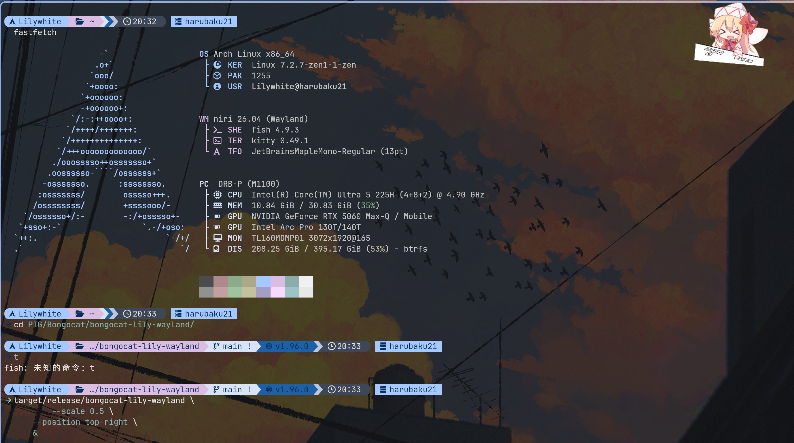

## bongocat-lily-wayland for stg

A low-overhead Lily White Bongo Cat overlay for wlroots-style Wayland
compositors, with niri as the primary target.

The renderer is event-driven: it sleeps when there is no Wayland or input
event. PNG layers are decoded and alpha-correctly scaled once at startup, transparent overlays
are trimmed in memory, and a frame composites only the background, optional key
highlight, and two arm layers into a `wl_shm` buffer.

### 面向niri桌面的stg桌宠莉莉！

这是面向wlroots风格Wayland合成器、以rust语言编写的 Lily-White BongoCat桌宠
悬浮键盘，主要针对 niri 开发。程序使用 layer-shell 创建一个透明悬浮层，它会直接读取 Linux
evdev 输入设备来驱动猫手和键盘高亮动画。





### 构建与运行
（咱先cd到源码所在工作目录
```sh
cargo build --release
cp bongocat.toml.example bongocat.toml
cargo run --release -- --config bongocat.toml
```

可以通过命令行覆盖窗口尺寸、位置和缩放,不过默认配置已经阔以了

```sh
# 指定逻辑像素尺寸、左上角锚点和边缘偏移。
cargo run --release -- --config bongocat.toml \
  --size 540x337 --position top-left --offset-x 30 --offset-y 50

# 保持配置中的宽高比，并将尺寸放大一倍。
cargo run --release -- --config bongocat.toml --scale 2
```

支持的位置包括：`top-left`、`top`、`top-right`、`left`、`center`、
`right`、`bottom-left`、`bottom`、`bottom-right`。

```sh
cargo run --release -- --config bongocat.toml.example --check
```

素材默认位于项目内的 `assets/keyboard/`，配置中的 `[assets].root` 指向该目录。

### 输入权限

Wayland 不会向普通客户端暴露全局键盘输入，因此程序直接读取
`/dev/input/event*`。
可以把当前用户
加入 `input` 组，然后重新登录

```sh
sudo usermod -aG input "$USER"
```

如果需要更严格的权限控制，可以在 `[input].devices` 中显式填写稳定的
`/dev/input/by-id/...` 设备路径。

### 按键映射

- 方向键使用 `righthand` 
- `X`、`Z`、左 Shift 使用 `lefthand` 素材
- 其他键盘按键按 QWERTY 物理位置分为左右手，不显示按键高亮。
- 鼠标左键、右键和中键分别让左手、右手和双手响应。
- 空格同时触发双手动画。

所有素材路径和按键绑定都可以在 TOML 中修改。程序使用 Linux `EV_KEY` 名称，

### 素材许可

源码是MIT许可，不过图片素材不属于 MIT 许可范围（侵权删捏qwq
PID:72826765
[原网址](https://www.pixiv.net/en/artworks/72826765)
## Artwork license

See `ASSETS.md`. The source-code MIT license does not grant permission to
redistribute artwork from the `assets/` directory.
PID:72826765
[Original artwork](https://www.pixiv.net/en/artworks/72826765)